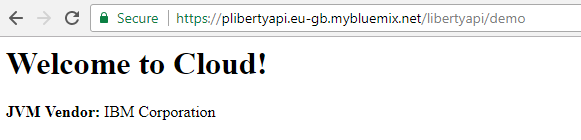
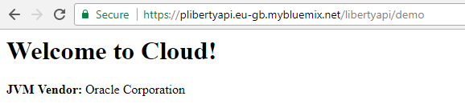

## A WebSphere Liberty Microprofile-1.2 based application prepared for deployment in IBM Cloud

**WebSphere Liberty** is a fast, dynamic, and easy-to-use Java application server, built on the open source 
[Open Liberty][openliberty] project. Ideal for developers but also ready for production, on-premise or [in the cloud][bluemix].

**IBM Bluemix** (is now **IBM Cloud**) is [the latest cloud offering][bluemix] from IBM. It enables organizations and developers 
to quickly and easily create, deploy, and manage applications on the cloud. Bluemix is an implementation of IBM's Open Cloud 
Architecture based on Cloud Foundry, an open source Platform as a Service (PaaS). IBM Cloud Foundry includes runtimes for Java, 
Node.js, PHP, Python, Ruby, Swift and Go; Cloud Foundry community build packs are also available.

Although IBM Cloud has already provided a runtime engine for WebSphere Liberty, sometimes this isn't enough and developers may need
their own version of the platform, i.e. a lightweight version based on Liberty Kernel, or an old version to ensure backward 
compatibility, or the version of WebSphere Liberty armed with a set of features specific for the developed application.

The project provides a demonstration of how to deploy your own installation of WebSphere Liberty to IBM Cloud as a usual Java
application. The deployed installation is armed with the latest version of **MicroProfile**, an open forum to collaborate on 
Enterprise Java Microservices, issued on October 3, 2017.

[Eclipse MicroProfile 1.2][microprofile] is built on the 1.1 version and updates the config API and adds the health check, fault
tolerance, metrics, and JWT propagation APIs. As stated on the official page of the project, the goal of MicroProfile is to iterate 
and innovate in short cycles, get community approval, release, and repeat. Eventually, the output of this project could be submitted 
to the JCP for possible future inclusion in a Java JSR (or some other standards body). The WebSphere Liberty application server 
implements MicroProfile 1.2, just the corresponding feature - `microprofile-1.2` - must be included in the *server.xml* 
configuration file.

### The application structure

The demo application is divided into three parts:
 1. *liberty-microprofile-app* - a web-application, which leverages MicroProfile 1.2. The application also contains a Java servlet
 that puts into the output stream the information about on which JVM he works. This information will be important when we try to 
 publish the application on different JVMs within the cloud platform.

 1. *liberty-microprofile-app-it* - a set of integration tests for the application. Please 
 [see below](#deploy-the-application-on-a-kubernetes-cluster) how to use the *[fabric8 maven plugin][f-m-p]* to deploy the 
 application on a WebSphere Liberty-based docker container running inside a Kubernetes cluster and run the integration tests 
 dependent on the containerized application. 

 1. *liberty-microprofile-wlp* - a Maven project with the liberty-assembly Maven packaging type that is used to create a packaged 
 WebSphere Liberty server. The project is critically dependent on *[liberty-maven-plugin]* and leverages the plugin to provide 
 the following actions:
 * install the WebSphere Liberty runtime
 * create an application server
 * install the `microprofile-1.2` feature to the WebSphere Liberty runtime
 * copy applications specified as Maven compile dependencies to WebSphere Liberty server's apps directory
 * package the WebSphere Liberty runtime

The *liberty-maven-plugin* configuration:

```xml
<plugin>
    <groupId>net.wasdev.wlp.maven.plugins</groupId>
    <artifactId>liberty-maven-plugin</artifactId>
    <extensions>true</extensions>
    <configuration>
        <configFile>src/main/wlp/server.xml</configFile>
        <serverName>apiServer</serverName>
        <looseApplication>true</looseApplication>
        <installAppPackages>dependencies</installAppPackages>        
        <stripVersion>true</stripVersion>
        <features>
            <acceptLicense>true</acceptLicense>
	    </features>
    </configuration>
</plugin>
```

The `configFile` and `serverName` parameters let the plugin know the server's name and where the server's configuration is. 
The `looseApplication` and `installAppPackages` say to the plugin to install the applications described in the `dependencies` section 
into the server's apps directory. **Note:** the `location` attribute of the `application`/`webApplication` elements inside the 
*server.xml* configuration file, if the elements present there, must match the artifact's name (without the version number since 
the `stripVersion` plugin parameter is set to `true`). Otherwise the additional application configuration file will be created and 
the application configuration including the `context-root` will be lost.

Because no features are specified within the `features` element of the plugin's configuration, all missing features declared in the 
*server.xml* file will be installed.

IBM Cloud translates requests to the application on port **8080**, so the `httpEndpoint` configuration element of the server must
up the server on host **0.0.0.0** and port **8080**. The server's full configuration can be found here: 
[server.xml](liberty-microprofile-wlp/src/main/wlp/server.xml).

### Build the application

To build the application do:

```
# mvn clean package
```

To package the WebSphere Liberty server and prepare it for deployment:

```
# mvn clean package -Ppackage-liberty
```

### 

[][deploy-to-bluemix]

By default IBM Cloud uses the *Java Buildpack Version: v3.19* buildpack to make a deployment of the application in the cloud. 
Since there are a number of executable files in the *wlp/bin* inside the WebSphere Liberty server archive, the buildpack isn't able 
to find the right one (*wlp/bin/server*). The following command must be specified for the Cloud Foundry Command Line Interface tool 
(as a parameter or in the *manifest.yml* file): `./wlp/bin/server run apiServer`. 

**Note:** `server run` is essential! If the `server start` is specified, the cloud infrastructure will seem the application has 
just been crashed after the start command exit. Once the command is specified, the path to the *java* command also must be set 
for the application. 

The *server* command reads the path from the `JAVA_HOME` environment variable. If the Java Buildpack is in use, the path to an 
OpenJDK installation must be assigned as the value of the variable: `/home/vcap/app/.java-buildpack/open_jdk_jre`. If the 
*Liberty Buildpack Version: v3.13* is taken into account, the following path to an *IBM JVM* installation must be in use: 
`/home/vcap/app/.java/jre`. If any out-of-memory problems are faced, the `JVM_ARGS` environment variable should be set.

The above parameters are collected into the *manifest.yml* file. To deploy the application in the cloud just do:

```
# cf push
```

When the command is completed, the application will be available by the configured URL:



If you prefer *OpenJDK* instead of *IBM JVM*, please use the following command:

```
# cf push -f ./manifest-oracle.yml
```

When the command is completed, the application will be available by the configured URL:



### Deploy the application on a Kubernetes cluster

**Kubernetes** is an open-source system for automating deployment, scaling, and management of containerized applications.

**Fabric8 Maven plugin** is a one-stop-shop for building and deploying Java applications for [Docker][docker], [Kubernetes][k8s] and 
[OpenShift][openshift]. It brings your Java applications on to Kubernetes and OpenShift. It provides a tight integration into maven 
and benefits from the build configuration already provided. It focuses on three tasks:
* Building Docker images
* Creating OpenShift and Kubernetes resources
* Deploy application on Kubernetes and OpenShift

The demo application uses the *[fabric8 maven plugin][f-m-p]* as an access point to Kubernetes: the application can be deployed on a 
WebSphere Liberty-based docker container running inside a Kubernetes cluster and the integration tests run dependent on the containerized
application.

To run the integration tests do the following commands:

1. On Windows, please, download *gofabric8.exe* using 

```
# mvn fabric8:setup -Pfabric8
```

2. If you use *[minikube]*, the cluster must be started. To start the cluster use the following command:

```
# minikube start
```
                        
3. All environment variables must be set before using this plugin, see the instruction generated by:

```
# gofabric8 docker-env
```  

4. Build the docker image for the `liberty-microprofile-app` application, deploy the image to Kubernetes and run the integration
   tests:

```
# mvn clean verify -Pfabric8 -DtestProxyHost=192.168.99.100
```

(if you are running the *minikube* virtual machine on *VirtualBox*, `-DtestProxyHost=192.168.99.100` helps you specify the virtual 
machine host.)

P.S. the `fabric8-maven-plugin` isn't able to generate a value of the `nodePort` parameter for exposed services, so a Kubernetes 
implementation generates a new port number for the service after each execution of the `fabric8:apply` goal. 
The [`org.codehaus.gmaven:groovy-maven-plugin`][groovy-maven-plugin] is used to get the dynamic bound `nodePort` value for the 
container with the demo application:

```xml
<plugin>
    <!-- how to get the dynamic bound nodePort for the container in the kubernetes cluster
         idea: https://stackoverflow.com/questions/13887436/maven-exec-bash-script-and-save-output-as-property
         kubectl must be declared in $PATH
    -->
    <groupId>org.codehaus.gmaven</groupId>
    <artifactId>groovy-maven-plugin</artifactId>
    <executions>
        <execution>
            <id>integration-test-get-proxy-port</id>
            <phase>pre-integration-test</phase>
            <goals>
                <goal>execute</goal>
            </goals>
            <configuration>
                <properties>
                    <script>kubectl get service ${applicationArtifactId} -n ${docker.user} -o jsonpath="{.spec.ports[0].nodePort}"</script>
                    <pause>${startPodPause}</pause>
                </properties>
                <source>
                    def pause = properties.pause as Integer             
                    def command = properties.script
                    def process = command.execute()
                    def outputStream = new StringBuffer()
                    process.waitForProcessOutput(outputStream, System.err)
                    def port = outputStream.toString().trim()
                    println "testProxyHttpPort = " + port
                    project.properties.testProxyHttpPort = port
                    println "Unfortunately the fabric8:start command is a background command, so a pause is needed to let the liberty profile start inside a docker container"
                    Thread.sleep(pause)
                </source>
            </configuration>
        </execution>
    </executions>
</plugin>
```

(The `kubectl` program must be declared in the environment variable `$PATH`.)


[openliberty]: http://openliberty.io/
[bluemix]: https://console.bluemix.net/
[microprofile]: https://projects.eclipse.org/projects/technology.microprofile
[liberty-maven-plugin]: https://github.com/WASdev/ci.maven#packaging-types
[deploy-to-bluemix]: https://bluemix.net/deploy?repository=https://github.com/samolisov/bluemix-liberty-microprofile-demo
[docker]: https://www.docker.com/
[k8s]: https://kubernetes.io/
[f-m-p]: https://maven.fabric8.io/
[openshift]: https://www.openshift.com/
[minikube]: https://github.com/kubernetes/minikube
[groovy-maven-plugin]: https://groovy.github.io/gmaven/groovy-maven-plugin/
    